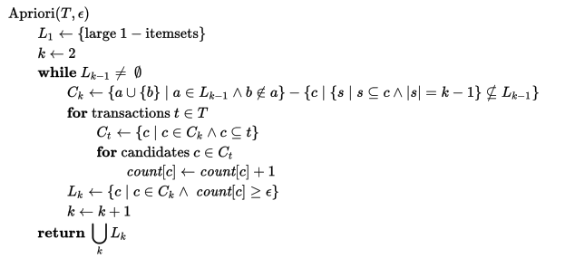
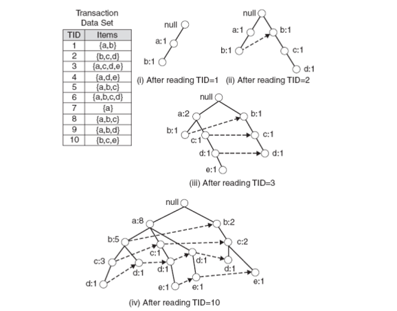
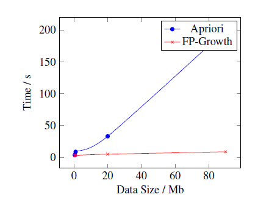
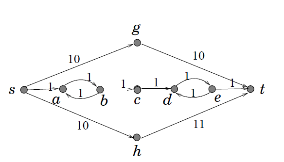
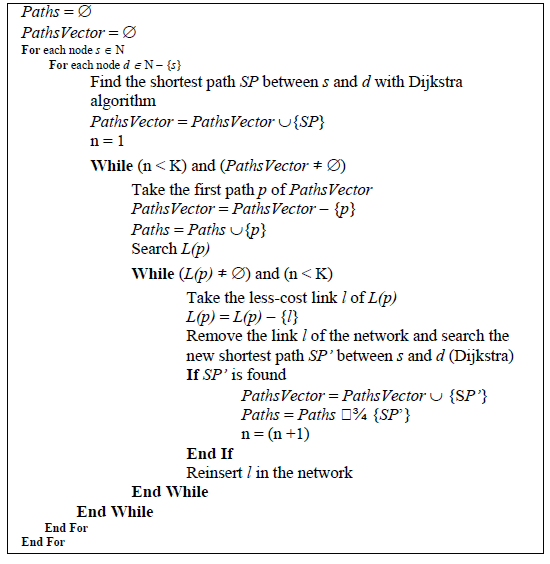
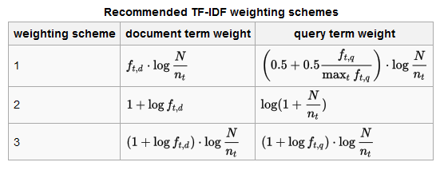
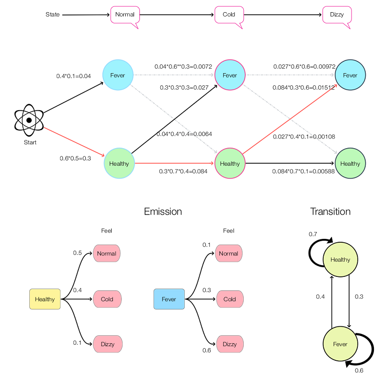

# Data Mining Algorithm
-----

##[Apriori](https://en.wikipedia.org/wiki/Apriori_algorithm)
Apriori is an algorithm for frequent item set mining and association rule learning over transactional databases. It proceeds by identifying the frequent individual items in the database and extending them to larger and larger item sets as long as those item sets appear sufficiently often in the database. The frequent item sets determined by Apriori can be used to determine association rules which highlight general trends in the database: this has applications in domains such as market basket analysis.

#### Limitations
Apriori algorithm can be slow and candidate generation is the bottleneck.
The database need to be scanned many times and the algorithm needs (n+1) scans,n is the length of the longest pattern.  

##[FP-Growth](https://en.wikibooks.org/wiki/Data_Mining_Algorithms_In_R/Frequent_Pattern_Mining/The_FP-Growth_Algorithm)

FP-Tree is constructed using 2 passes over the data-set.
Pass 1:

- Scan data and find support for each item.
- Discard infrequent items.
- Sort frequent items in decreasing order based on their support.

Pass 2:
Nodes correspond to items and have a counter

- FP-Growth reads 1 transaction at a time and maps it to a path
- Fixed order is used, so paths can overlap when transactions share items (when they have the same prfix ).In this case, counters are incremented
- Pointers are maintained between nodes containing the same item, creating singly linked lists (dotted lines) The more paths that overlap, the higher the compression. FP-tree may fit in memory.
- Frequent itemsets extracted from the FP-Tree.
  
  

#### Advantages of FP-Growth

- only 2 passes over data-set
- "compresses" data-set
- no candidate generation
- much faster than Apriori

#### Disadvantages of FP-Growth

- FP-Tree may not fit in memory
- FP-Tree is expensive to build

### Comparison   

##KSP (k shortest paths)

The k shortest paths problem is a natural and longstudied generalization of the shortest path problem, in which not one but several paths in increasing order of length are sought. Given a directed graph G with nonnegative
edge weights, a positive integer k, and two vertices s and t, the problem asks for the k shortest paths from s to t in increasing order of length.

We require that the paths be simple (loop free). See Figure 1 for an example illustrating the difference between the k shortest paths problem with and without the simplicity constraint. (As the figure shows, even in graphs with non-negative weights, although the shortest path is always simple, the subsequent paths can have cycles.) The k shortest paths problem in which paths are not required to be simple turns out to be significantly easier. An O(m + kn log n) time algorithm for this problem has been known since 1975; a recent improvement by Eppstein essentially achieves the optimal time of O(m + n log n + k)—the algorithm computes an implicit representation of the paths, from which each path can be output in O(n) additional time.

  

Figure 1: The difference between simple and nonsimple k shortest paths. The three simple shortest paths have lengths 6; 20 and 21, respectively. Without the simplicity constraint, paths may use the cycles (a; b; a) and (d; e; d), giving shortest paths of lengths 6; 8; 10.

The problem of determining the k shortest simple paths has proved to be more challenging. The problem was originally examined by Hoffman and Pavley ,but nearly all early attempts to solve it led to exponential time algorithms . The best result known to date is an algorithm by Yen  (generalized by Lawler ), which using modern data structures can be implemented in O(kn(m+n log n)) worstcase time. This algorithm essentially performs O(n) single-source shortest path computations for each output path. In the case of undirected graphs, Katoh,Ibaraki, and Mine improve Yen’s algorithm to O(k(m+n log n)) time. While Yen’s asymptotic worstcase bound for enumerating k simple shortest paths in a directed graph remains unbeaten, several heuristic improvements to his algorithm have been proposed and implemented, as have other algorithms with the same
worst-case bound.

##TF-IDF

In information retrieval, tf–idf, short for term frequency–inverse document frequency, is a numerical statistic that is intended to reflect how important a word is to a document in a collection or corpus. It is often used as a weighting factor in information retrieval and text mining. The tf-idf value increases proportionally to the number of times a word appears in the document, but is offset by the frequency of the word in the corpus, which helps to adjust for the fact that some words appear more frequently in general.

Variations of the tf–idf weighting scheme are often used by search engines as a central tool in scoring and ranking a document's relevance given a user query. tf–idf can be successfully used for stop-words filtering in various subject fields including text summarization and classification.

One of the simplest ranking functions is computed by summing the tf–idf for each query term; many more sophisticated ranking functions are variants of this simple model.

##Viterbi
The Viterbi algorithm is a dynamic programming algorithm for finding the most likely sequence of hidden states – called the Viterbi path – that results in a sequence of observed events, especially in the context of Markov information sources and hidden Markov models.

The algorithm has found universal application in decoding the convolutional codes used in both CDMA and GSM digital cellular, dial-up modems, satellite, deep-space communications, and 802.11 wireless LANs. It is now also commonly used in speech recognition, speech synthesis, diarization, keyword spotting, computational linguistics, and bioinformatics. For example, in speech-to-text (speech recognition), the acoustic signal is treated as the observed sequence of events, and a string of text is considered to be the "hidden cause" of the acoustic signal. The Viterbi algorithm finds the most likely string of text given the acoustic signal.

e.g.  

##Cosin Similarity 

Cosine similarity is a measure of similarity between two non zero vectors of an inner product space that measures the cosine of the angle between them. The cosine of 0° is 1, and it is less than 1 for any other angle. It is thus a judgment of orientation and not magnitude: two vectors with the same orientation have a cosine similarity of 1, two vectors at 90° have a similarity of 0, and two vectors diametrically opposed have a similarity of -1, independent of their magnitude. Cosine similarity is particularly used in positive space, where the outcome is neatly bounded in.

Note that these bounds apply for any number of dimensions, and cosine similarity is most commonly used in high-dimensional positive spaces. For example, in information retrieval and text mining, each term is notionally assigned a different dimension and a document is characterised by a vector where the value of each dimension corresponds to the number of times that term appears in the document. Cosine similarity then gives a useful measure of how similar two documents are likely to be in terms of their subject matter.

The technique is also used to measure cohesion within clusters in the field of data mining.

Cosine distance is a term often used for the complement in positive space, that is: Dc ( A , B ) = 1 − Sc ( A , B ). It is important to note, however, that this is not a proper distance metric as it does not have the triangle inequality property and it violates the coincidence axiom; to repair the triangle inequality property while maintaining the same ordering, it is necessary to convert to angular distance.

One of the reasons for the popularity of cosine similarity is that it is very efficient to evaluate, especially for sparse vectors, as only the non-zero dimensions need to be considered.

Given two vectors of attributes, A and B, the cosine similarity, cos(θ), is represented using a dot product and magnitude as
  
 where Ai and Bi are components of vector A and B respectively.